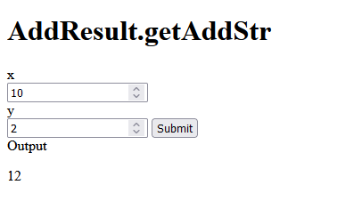

# Attributes

demo_gen does a lot in its attempt to automagically generate demonstrations for you. Sometimes however, hands on configuration is required.

Find below a list of the attributes that demo_gen supports.

## \#\[diplomat::attr\]

demo_gen supports all attributes listed in the [attrs chapter](../attrs.md). You mostly will want to use the `disable` attribute, to disable any functions that you may not want to include in output.

Because demo_gen is so heavily based on the JS backend, any `#[diplomat::attr]`s that apply to the JS backend will also apply to the demo_gen backend. So for example, any methods disabled in the JS backend will also be disabled in demo_gen's output.

## \#\[diplomat::demo\]

This is the core attribute that demo_gen looks for in configuring its output. There are a few supported attributes currently:

### \#\[diplomat::demo(generate)\] 

Used in explicit generation of output. See [markup](./markup.md) for more.

### \#\[diplomat::demo(default_constructor)\]

demo_gen will throw errors for any Opaque types that do not have a method labelled with this attribute. demo_gen also looks for any Opaque methods labelled with `#[diplomat::attr(auto, constructor)]` as an alternative.

You should label each Opaque in your FFI definition with a `default_constructor` attribute, where the method is one you expect most users to call regularly when trying to create the Opaque in question. If your Opaque does not have an associated constructor method in its `impl` block, you should consider disabling functions (as this sort of behavior is too advanced for demo_gen to parse correctly).

For reasons on why demo_gen requires explicit labelling of Opaque constructors, see [the demo_gen design doc](https://github.com/rust-diplomat/diplomat/blob/main/docs/demo_gen.md).

### \#\[diplomat::demo(external)\]

Can be used above a parameter, struct field, or Opaque type.

It represents any input that you want to specify custom behavior for in the [rendering](./renderer.md) Javascript.

For example: In ICU4X, we have a `DataProvider` Opaque type that must be compiled ahead of time, and so we flag it as an external type:

```rs
#[diplomat::bridge]
mod ffi {
	#[diplomat::opaque]
	#[diplomat::demo(external)]
	pub struct DataProvider;
}
```

We then override the [default renderer's runtime.mjs](renderer.md#runtimemjs) file to provide the compiled `DataProvider` when it is requested.

### \#\[diplomat::demo(input(...))\]

For configuring user input to your demos. `input(...)` takes in a comma separated list of values.

May be used on parameters or struct fields to configure specific properties passed to the [renderer](renderer.md).

Here are some valid `input` values:

- `input(label = "Label Here")`. Changes the label a given function parameter will have in the output.

#### Input Example

If we modify our [quickstart](quickstart.md) example, we can add `#[diplomat::demo(input(...))]` labels to the function parameters:

```rs
#[diplomat::bridge]
mod ffi {
    use std::fmt::Write;

	#[diplomat::opaque]
	#[diplomat::rust_link(basic_adder, Mod)]
	pub struct AddResult;

	impl AddResult {
		pub fn get_add_str(
			#[diplomat::demo(input(label = "x"))]
			left : u32, 
			#[diplomat::demo(input(label = "y"))]
			right : u32, write: &mut DiplomatWrite) {
			write.write_str(&format!("{}", basic_adder::add(left, right))).unwrap();
			write.flush();
		}
	}
}
```

Which creates the following HTML output:



### \#\[diplomat::demo(custom_func="...")\]

See [Making Custom Functions](./custom_functions.md).